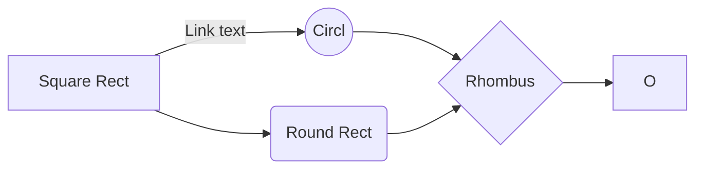

# Get Practice Github!!

## Todo.

- [x] Fetch From another place practicandogit2
- [x] Make changes to files and push it

# practicandogit
Practicando FETCH
Todo
[ ] Aprender el concepto de las ramas
